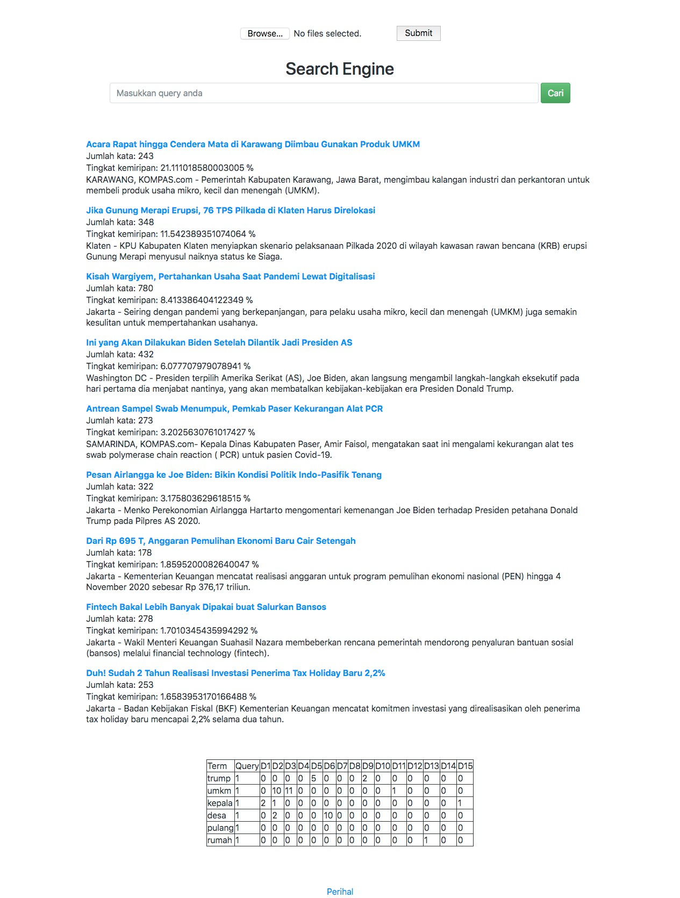

# Mesin Pencarian
> Program ini adalah aplikasi dari Dot Product pada Sistem Temu-balik Informasi yang telah dipelajari di kuliah IF2123 Aljabar Linier dan Geometri.

## Daftar Isi
* [Informasi Umum](#informasi-umum)
* [Screenshots](#screenshots)
* [Pengaturan dan Instalasi](#pengaturan-dan-instalasi)
* [Fitur](#fitur)
* [Status](#status)
* [Inspirasi](#inspirasi)
* [Kontak](#kontak)

## Informasi Umum
Program ini dibuat dalam rangka menyelesaikan tugas besar kuliah IF2123 Aljabar Linier dan Geometri. Pada program ini kami menggunakan bahasa pemrograman Python dan menggunakan micro web framework Flask. Program ini bekerja dengan menerima input pengguna lalu akan menampilkan beberapa dokumen serta menunjukkan persentase kesamaan dokumen dengan kata yang ingin kita temukan. Program ini memanfaatkan <i>dot product</i> dalam algoritma pemrogramannya dengan persamaan similarity = (Query●Dokumen)/(||Query|| ||Dokumen||)

## Screenshots


## Pengaturan dan instalasi
* Pastikan python3 (versi yang direkomendasikan) sudah terinstall di PC anda.
* Install beberapa modul berikut jika belum anda install sebelumnya.
  * flask_bootstrap
  * wtforms
  * werkzeug
  * sastrawi
* Setelah semua modul terintstall, pindahkan file dari repository ini ke lokal lalu buka terminal dan pindahkan direktori ke lokasi penyimpanan yang anda gunakan sebelumnya.
* Jalankan app.py di terminal dengan command `python3 app.py` lalu tekan enter dan tunggu beberapa saat. <i>(jika menggunakan Python versi lain dapat menyesuaikan)</i>
* Tunggu sampai muncul tulisan seperti di bawah ini pada terminal anda.
```
 * Serving Flask app "app" (lazy loading)
 * Environment: production
   WARNING: This is a development server. Do not use it in a production deployment.
   Use a production WSGI server instead.
 * Debug mode: on
 * Running on http://127.0.0.1:5000/ (Press CTRL+C to quit)
```

* Buka http://127.0.0.1:5000/search pada browser anda.
* Program siap dijalankan dengan memasukkan kata kunci dari dokumen yang ingin anda cari seperti pada <i>search engine</i> umumnya(Google, Bing, dll). 
* Jika ingin membuka dokumen Anda hanya perlu mengklik judul yang muncul setelah Anda memasukkan kata kunci di mesin pencarian.
* Informasi lengkap tentang program dapat diakses pada halaman Perihal yang ada di bagian tengah bawah atau dapat diakses melalui /perihal pada local host anda.

## contoh hasil penggunaan 
Berikut adalah contoh hasil pencarian dari mesin pencarian
```
Query: trump joe biden umkm kepala desa

Ini yang Akan Dilakukan Biden Setelah Dilantik Jadi Presiden AS
Jumlah kata: 432
Tingkat kemiripan: 25.52637351213155 %
Washington DC - Presiden terpilih Amerika Serikat (AS), Joe Biden, akan langsung mengambil langkah-langkah eksekutif pada hari pertama dia menjabat nantinya, yang akan membatalkan kebijakan-kebijakan era Presiden Donald Trump.

Acara Rapat hingga Cendera Mata di Karawang Diimbau Gunakan Produk UMKM
Jumlah kata: 243
Tingkat kemiripan: 21.111018580003005 %
KARAWANG, KOMPAS.com - Pemerintah Kabupaten Karawang, Jawa Barat, mengimbau kalangan industri dan perkantoran untuk membeli produk usaha mikro, kecil dan menengah (UMKM).

Pesan Airlangga ke Joe Biden: Bikin Kondisi Politik Indo-Pasifik Tenang
Jumlah kata: 322
Tingkat kemiripan: 17.466919962901834 %
Jakarta - Menko Perekonomian Airlangga Hartarto mengomentari kemenangan Joe Biden terhadap Presiden petahana Donald Trump pada Pilpres AS 2020.
```

## Fitur
Beberapa fitur yang tersedia:
* Upload dokumen yang ingin dicari (sejumlah 15 dokumen)

Fitur-fitur yang dapat ditambahkan:
* Mengambil teks dari Internet dengan menggunakan <i>web scraping</i>

## Status
Program telah selesai dibuat dan akan dikembangkan jika memang diperlukan.

## Inspirasi
“Aplikasi Dot Product pada sistem temu balik aplikasi” oleh Rinaldi Munir
https://informatika.stei.itb.ac.id/~rinaldi.munir/AljabarGeometri/2020-2021/Algeo-12-Aplikasi-dot-product-pada-IR.pdf
"Templating With Jinja2 in Flask: Essentials" oleh Shalabh Aggarwal
https://code.tutsplus.com/tutorials/templating-with-jinja2-in-flask-essentials--cms-25571
"Flask Forms-Accept User Input Using Flask Forms"
https://www.askpython.com/python-modules/flask/flask-forms


## Kontak
Dibuat oleh Kelompok 38 Tugas Besar 2 IF2123 Aljabar Linier dan Geometri  
Rhea Elka Pandumpi, Michael Owen, Jeanne D’Arc Amara Hanieka  
13519047, 13519055, 13519082  

Kontak yang dapat dihubungi:  
* E-mail: 13519082@std.stei.itb.ac.id
* No HP: +6281280403538


